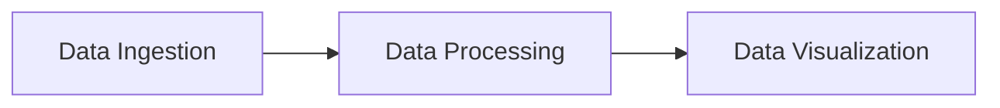
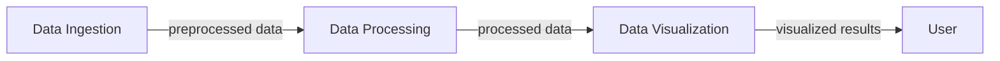

# Core Workflows and Data Flows
The ML-Models project is designed to process and transform data using various machine learning algorithms. The core workflows and data flows are described below.

## System Architecture
The system architecture consists of the following components:
- Data Ingestion: responsible for collecting and preprocessing data from various sources.
- Data Processing: applies machine learning algorithms to the preprocessed data.
- Data Visualization: presents the results of the data processing in a meaningful way.

## Core Workflows
The core workflows are as follows:
- Data Ingestion Workflow: collects data from various sources, preprocesses it, and stores it in a database.
- Data Processing Workflow: retrieves data from the database, applies machine learning algorithms, and stores the results.
- Data Visualization Workflow: retrieves the results from the database and presents them in a meaningful way.

## Data Flows
The data flows between the components are as follows:

The data flows from the Data Ingestion component to the Data Processing component, and then from the Data Processing component to the Data Visualization component.

## Code Examples
The following code snippet from the `bird-prediction-1.ipynb` file demonstrates how data is processed and transformed:
```python
# Import necessary libraries
import pandas as pd
from sklearn.model_selection import train_test_split
from sklearn.ensemble import RandomForestClassifier
from sklearn.metrics import accuracy_score

# Load data
data = pd.read_csv('data.csv')

# Preprocess data
X = data.drop('target', axis=1)
y = data['target']

# Split data into training and testing sets
X_train, X_test, y_train, y_test = train_test_split(X, y, test_size=0.2, random_state=42)

# Train model
model = RandomForestClassifier(n_estimators=100, random_state=42)
model.fit(X_train, y_train)

# Make predictions
y_pred = model.predict(X_test)

# Evaluate model
accuracy = accuracy_score(y_test, y_pred)
print(f'Accuracy: {accuracy:.3f}')
```
This code snippet demonstrates how to load data, preprocess it, split it into training and testing sets, train a model, make predictions, and evaluate the model.

## Setup Instructions
To set up the ML-Models project, follow these steps:
1. Clone the repository using `git clone git@github.com:ml-models/ml-models.git`.
2. Install the required libraries using `pip install -r requirements.txt`.
3. Run the data ingestion workflow using `python data_ingestion.py`.
4. Run the data processing workflow using `python data_processing.py`.
5. Run the data visualization workflow using `python data_visualization.py`.

## Mermaid Art Diagrams
The following mermaid art diagram represents the component relationships and flows:

This diagram shows the flow of data between the components and how the results are presented to the user.