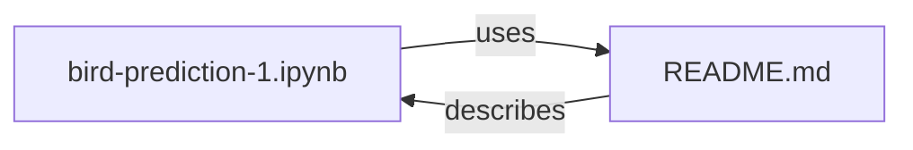

# System Architecture
The ML-Models project is a Git repository that contains various files and folders related to machine learning models. The directory structure is as follows:
workdir/ML-Models/
|-- .git/
|-- .gitattributes
|-- bird-prediction-1.ipynb
|-- README.md

## Components
The project consists of several components, including:
* `bird-prediction-1.ipynb`: a Jupyter Notebook file that contains the implementation of a machine learning model for bird prediction.
* `README.md`: a Markdown file that provides an overview of the project and its contents.

## Relationships
The components of the project are related as follows:

This diagram shows that the `bird-prediction-1.ipynb` file uses the `README.md` file, and the `README.md` file describes the `bird-prediction-1.ipynb` file.

## Setup Instructions
To set up the project, follow these steps:
1. Clone the repository using Git: `git clone git@github.com:username/ML-Models.git`
2. Install the required dependencies: `pip install -r requirements.txt`
3. Open the `bird-prediction-1.ipynb` file in a Jupyter Notebook environment and run the cells to train the model.

## Code Examples
The `bird-prediction-1.ipynb` file contains the following code:
```python
import pandas as pd
from sklearn.ensemble import RandomForestClassifier
from sklearn.model_selection import train_test_split

# Load the dataset
df = pd.read_csv('data.csv')

# Split the data into training and testing sets
X_train, X_test, y_train, y_test = train_test_split(df.drop('target', axis=1), df['target'], test_size=0.2, random_state=42)

# Train a random forest classifier
clf = RandomForestClassifier(n_estimators=100, random_state=42)
clf.fit(X_train, y_train)
```
This code loads a dataset, splits it into training and testing sets, and trains a random forest classifier using the training data.